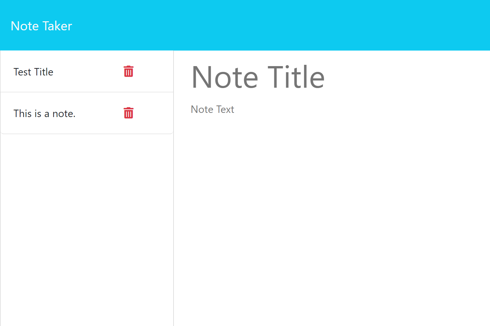

# Notes App
## Description
This application is a notes app built using Express and deployed on Heroku. The application can be found [here](https://heath-notes-app-8f5c407f8957.herokuapp.com/notes). The application is designed using core elements of OOP and separation of concerns, though additional refactors can further separate functions across the application.

The application uses generated UUIDs to track individual entries through the application to manipulate and delete them upon request. Future implementations should track user sessions with cookies and store this data in order to ensure users are only served their own data.

See the a screenshot below:

## Installation

N/A

## Usage

Visit the url and interact with the ui to add and delete notes.

## Credits

N/A